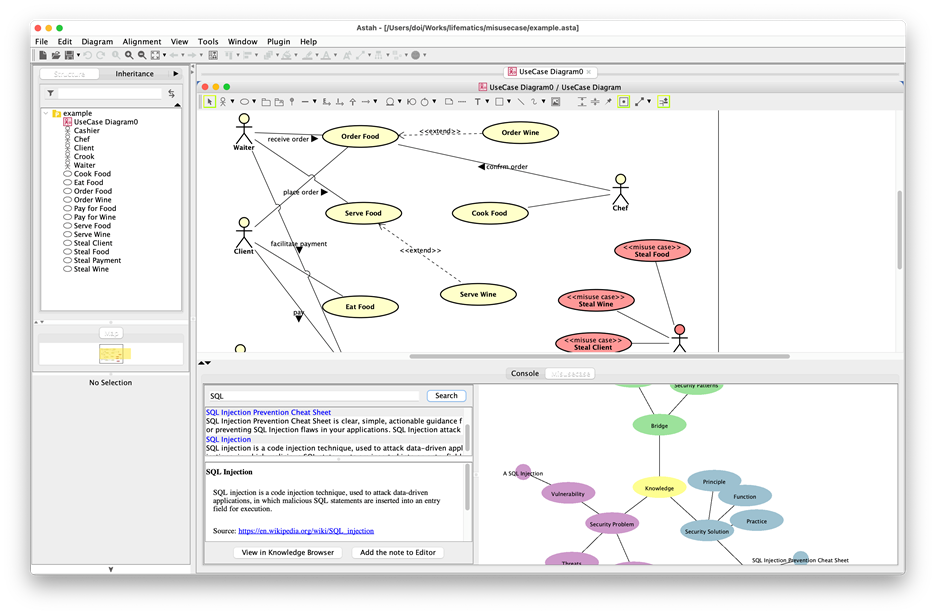
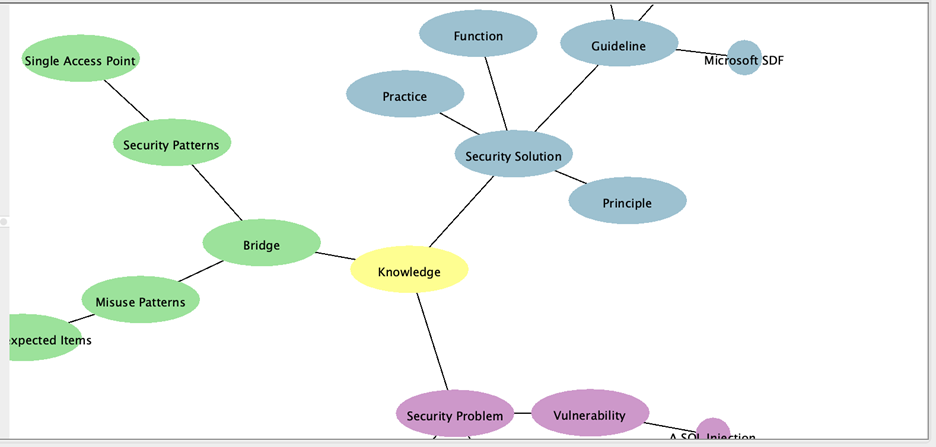
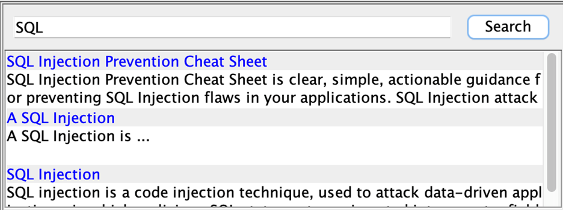
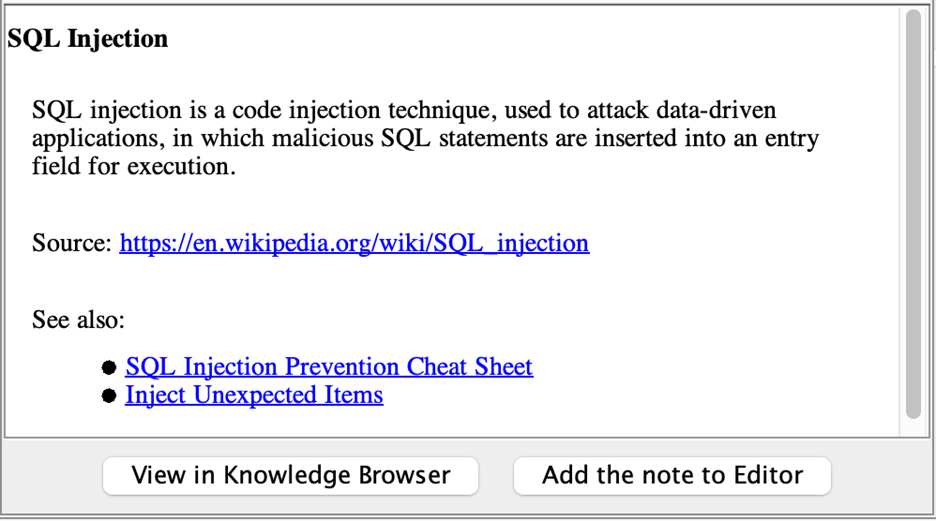

# Security Analysis Tool
# User's manual

### Overview

This document describes how to use the "Security Analysis Tool" (hereinafter referred to as "this tool").

### Operating requirements

This tool is a plug-in of the modeling tool astah * professional. Therefore, in order to use this tool, an environment in which astah * professional 8.3 and astah * professional operate is required.

### Installation method

1.	Start astah *  
2.	Drag and drop this tool (misusecase-tool.X.X.X.jar) onto the astah * diagram. 
3.	The plug-in overview dialog is displayed. Select [Yes]. 
4.	Restart astah * according to the message that appears next

### Function

#### Overview

This tool provides functions in the extended view (red frame in the figure below) on astah *. The extended view is divided into three areas, the right side is the "knowledge browser", the upper left part is the "knowledge search view", and the lower left part is the "knowledge detail view".

#### Knowledge Browser

In the knowledge browser, the relationship of knowledge of misuse cases can be confirmed as a graph structure. On this browser, the abstract knowledge (class) is represented by an ellipse, and the concrete method (instance) is represented by a perfect circle. 
The display area can be changed by operating with the arrow keys in the area where the knowledge graph cannot be confirmed greatly.

#### Knowledge search view

In the knowledge search view, you can search for knowledge of misuse cases. Enter a keyword in the text box at the top and press the [Search] button to display a list of knowledge that includes that keyword in the name. Also, if you click a specific knowledge from the list, the details can be displayed in the knowledge details view. 

#### Knowledge detail  view

In the knowledge detail view, you can check the name of the knowledge, detailed description, information source, and related knowledge.
When you click the link of the information source on this screen, the URL is displayed on the Web browser.
You can view the knowledge in the knowledge detail view by clicking the knowledge of the related knowledge.
By clicking [View in Knowledge Browser] at the bottom of the screen, you can highlight the knowledge in the knowledge browser with a red frame.
Also, if you click [Add the note to Editor], in astah *, only when you are editing the use case diagram, you can create a model with the displayed knowledge as a misuse case and add a node in the diagram.

